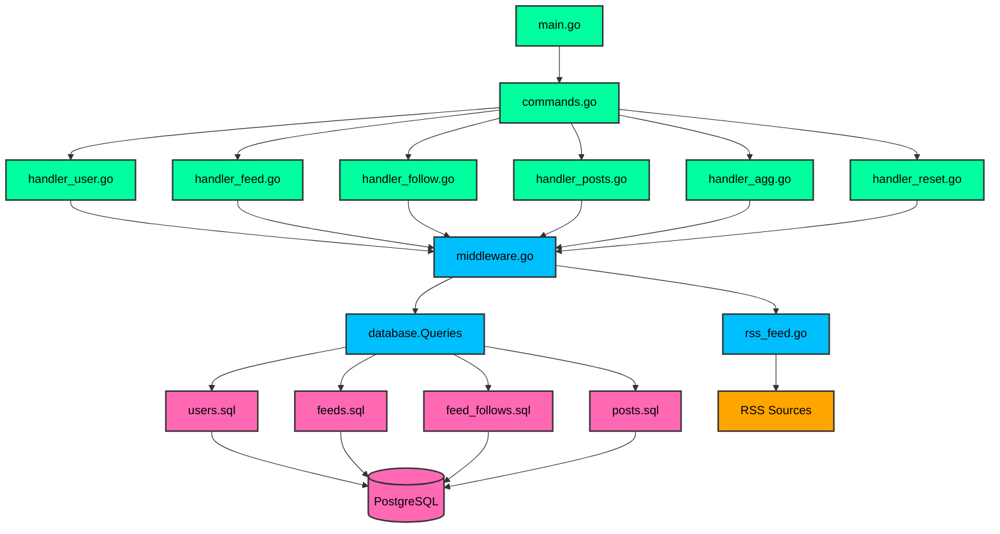

# 🐊 Gator

Gator is a lightweight command-line tool built in Go that allows you to aggregate and read RSS feeds directly from your terminal. Stay updated with your favorite websites without ever leaving your command line!

## Why Gator?

Keeping up with numerous RSS feeds can be challenging, especially when most readers are bloated web apps or desktop applications. As someone who spends a lot of time in the terminal, I wanted an efficient, terminal-based solution that is:

- **Fast and lightweight**: Minimal resource usage, perfect for low-memory devices.
- **Entirely terminal-based**: No GUI, no distractions—just pure command-line goodness.
- **Multi-user friendly**: Supports multiple user accounts on the same system.
- **Smart feed management**: Easily follow and unfollow feeds, with automatic updates.

I built Gator to solve these problems, providing a simple CLI tool that fetches and displays RSS feeds directly in your terminal. No browser needed, no fancy UI—just your favorite content at your fingertips.

## 🏗 Architecture



## 🚀 Quick Start

1. **Install Gator using the Go toolchain**
    ```bash
    go install github.com/yourusername/gator@latest
    ```

2. **Create your account**
    ```bash
    gator register myusername
    ```

3. **Follow some feeds**
    ```bash
    gator follow "https://blog.boot.dev/index.xml"
    gator follow "https://news.ycombinator.com/rss"
    ```

4. **Start reading!**
    ```bash
    gator browse
    ```

## 📖 Usage

### Available Commands

- `register <name>` - Create a new user account.
- `login <name>` - Log in to an existing account.
- `follow <url>` - Follow a new RSS feed.
- `unfollow <url>` - Unfollow an RSS feed.
- `following` - List all your followed feeds.
- `browse [limit] [page]` - Read posts with pagination.
  - `browse` - Show 10 posts from page 1.
  - `browse 5` - Show 5 posts from page 1.
  - `browse 5 2` - Show 5 posts from page 2.
- `agg <interval>` - Start collecting posts at regular intervals (e.g., `agg 1m`).

### Examples

Unfollow a feed:

```bash
gator unfollow "https://blog.boot.dev/index.xml"
```

Start the aggregator to fetch updates every 10 minutes:

```bash
gator agg 10m
```

### Advanced Features

- **Pagination**: Easily navigate through large numbers of posts.
- **Customizable Fetch Intervals**: Set how often you want to check for new posts.
- **Multi-user Support**: Multiple users can have separate accounts on the same system.
- **Automatic Feed Updates**: Gator automatically fetches the latest posts from your followed feeds.

## 🤝 Contributing

1. **Clone the repository**
    ```bash
    git clone https://github.com/yourusername/gator.git
    cd gator
    ```

2. **Build the project**
    ```bash
    go build
    ```

3. **Run the project**
    ```bash
    ./gator
    ```

4. **Run the tests**
    ```bash
    go test ./...
    ```

5. **Submit a pull request**

    If you'd like to contribute, please fork the repository and open a pull request to the `main` branch.

